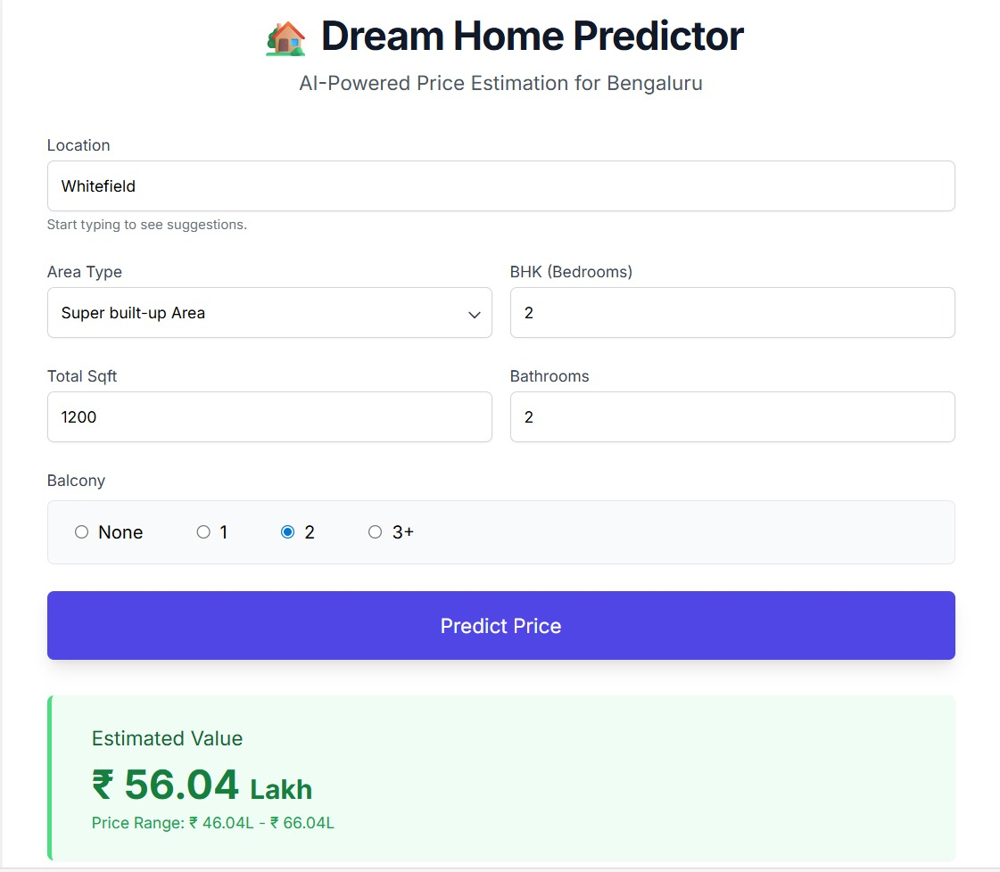

```markdown
# 🏡 Bengaluru House Price Predictor

A Machine Learning powered web application that predicts real estate prices in Bengaluru based on location, square footage, BHK, and other parameters.


## 🚀 Features
- **Smart Location Search:** Auto-complete suggestions for 1,300+ locations in Bengaluru.
- **Accurate Predictions:** Uses an optimized **XGBoost Regressor** model (~80% Accuracy).
- **Modern UI:** Built with HTML5 & Tailwind CSS for a responsive design.
- **Fast API:** Powered by FastAPI for lightning-fast inference.

## 📂 Project Structure

```

├── model/
│   ├── bengaluru_house_price_final.pkl  # Trained ML Model
├── data/
│   ├── Bengaluru_House_Data.csv         # Dataset (for dropdowns)
├── app.py                               # FastAPI Backend
├── index.html                           # Frontend UI
├── requirements.txt                     # Dependencies
└── README.md                            # Documentation

```

## 🛠️ Installation & Setup

1. **Clone the Repository**
   ```bash
   git clone [https://github.com/your-username/bengaluru-house-price-predictor.git](https://github.com/your-username/bengaluru-house-price-predictor.git)
   cd bengaluru-house-price-predictor

```

2. **Install Dependencies**
```bash
pip install -r requirements.txt

```


3. **Run the Application**
```bash
uvicorn app:app --reload

```


4. **Access the App**
Open your browser and go to: `http://127.0.0.1:8000`

## 🧠 Model Details

* **Algorithm:** XGBoost Regressor
* **Data Cleaning:** Handled outliers, missing values, and inconsistent units.
* **Feature Engineering:** dimensionality reduction on 'Location' and 'Area Type'.
* **Performance:** Tuned using GridSearchCV for optimal hyperparameters.

## 📸 Screenshot

---

Made with ❤️ by Ishwar

```
